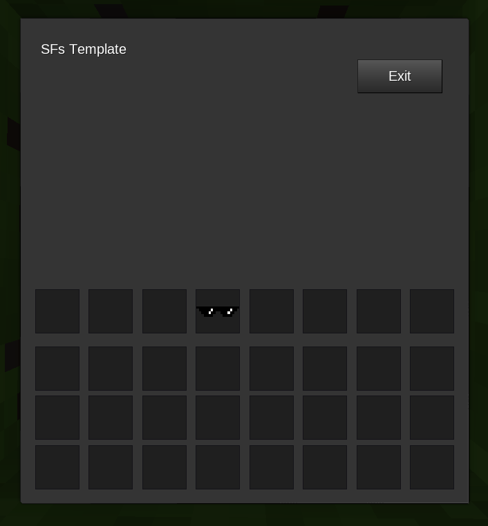

# Simple Formspec

A cleaner, simpler solution to having an advanced inventory in Minetest.

Originally Written by rubenwardy as sfinv.

License: MIT

## API

It is recommended that you read this link for a good introduction to the sfs API
by its author: https://rubenwardy.com/minetest_modding_book/en/players/sfinv.html

This modified sfinv mod does not use a global table for callbacks, and internalizes some functions within the API. 

SFs also does not use the player inventory formspec, instead it uses the minetest.show_formspec callback.

It is meant to be an embedded framework for other mods using formspec, but if needed it could be modified to use globally. 

### sfs Methods

**Pages**

* sfs.set_page(player, pagename) - changes the page
* get_homepage_name(player) - get the page name of the first page to show to a player
* sfs.register_page(name, def) - register a page, see section below
* sfs.override_page(name, def) - overrides fields of an page registered with register_page.
    * Note: Page must already be defined, (opt)depend on the mod defining it.
* sfs.show_player_formspec(player) - (re)builds page formspec
             and calls minetest.show_formspec().
* sfs.get_formspec(player, context) - builds current page's formspec

**Contexts**

* sfs.get_or_create_context(player) - gets the player's context
* sfs.set_context(player, context)

**Theming**

* sfs.make_formspec(player, context, content, show_inv, size) - adds a theme to a formspec
    * show_inv, defaults to false. Whether to show the player's main inventory
    * size, defaults to `size[8,8.6]` if not specified
* get_nav_fs(player, context, nav, current_idx) - creates tabheader or ""

### sfs Members

* pages - table of pages[pagename] = def
* pages_unordered - array table of pages in order of addition (used to build navigation tabs).
* contexts - contexts[playername] = player_context

### Context

A table with these keys:

* page - current page name
* nav - a list of page names
* nav_titles - a list of page titles
* nav_idx - current nav index (in nav and nav_titles)
* any thing you want to store
    * sfs will clear the stored data on log out / log in

### sfs.register_page

sfs.register_page(name, def)

def is a table containing:

* `title` - human readable page name (required)
* `get(self, player, context)` - returns a formspec string. See formspec variables. (required)
* `is_in_nav(self, player, context)` - return true to show in the navigation (the tab header, by default)
* `on_player_receive_fields(self, player, context, fields)` - on formspec submit.
* `on_enter(self, player, context)` - called when the player changes pages, usually using the tabs.
* `on_leave(self, player, context)` - when leaving this page to go to another, called before other's on_enter

### get formspec

Use sfs.make_formspec to apply a layout:

	return sfs.make_formspec(player, context, [[
		list[current_player;craft;1.75,0.5;3,3;]
		list[current_player;craftpreview;5.75,1.5;1,1;]
		image[4.75,1.5;1,1;gui_furnace_arrow_bg.png^[transformR270]
		listring[current_player;main]
		listring[current_player;craft]
		image[0,4.25;1,1;gui_hb_bg.png]
		image[1,4.25;1,1;gui_hb_bg.png]
		image[2,4.25;1,1;gui_hb_bg.png]
		image[3,4.25;1,1;gui_hb_bg.png]
		image[4,4.25;1,1;gui_hb_bg.png]
		image[5,4.25;1,1;gui_hb_bg.png]
		image[6,4.25;1,1;gui_hb_bg.png]
		image[7,4.25;1,1;gui_hb_bg.png]
	]], true)

See above (methods section) for more options.

### Customising themes

local function get_nav_fs(player, context, nav, current_idx)
  -- Only show tabs if there is more than one page
  if #nav > 1 then
    return "tabheader[0,0;sfs_nav_tabs;" .. table.concat(nav, ",") ..
        ";" .. current_idx .. ";true;false]"
  else
    return ""
  end
end

local theme_inv = [[
    list[current_player;main;0,5.2;8,1;]
    list[current_player;main;0,6.35;8,3;8]
  ]]